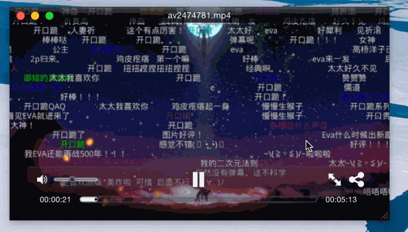

# Biliass

Bilibili的ASS字幕下载与生成工具
Biliass可以根据B站某视频的地址下载xml格式字幕，然后转换成ass格式的字幕。
可以由各种主流播放器加载显示，呈现出弹幕效果。

配合Bilidown食用风味更佳。

### 基本用法

在bin目录下可以找到可执行文件biliass

Usage: biliass [options]

  Options:

    -h, --help               output usage information
    -V, --version            output the version number
    -u, --url [url]          The url of the video page
    -d, --dir [directory]    The directory to which the ass subtitle will be saved (absolute or relative). Default to the current execution directory.
    -n, --nth [page_number]  The number of the subpage you want to download the subtitle from.(In the case where one video page has multiple subpages) Default to 1

示例（先创建subtitles文件夹）：
bin/biliass -d ./subtitles -n 2 -u http://www.bilibili.com/video/av2474781/

这行命令将把该视频part 2的弹幕的ass格式下载到当前目录下的subtitles文件夹下

biliass同样可作为node模块使用，参考bin/biliass

### 安装

首先确认安装了Node.js与npm工具，参考 https://nodejs.org 与 https://www.npmjs.com

git clone以后，在项目目录下执行`npm install`安装依赖后即可使用

在项目目录下执行 sudo npm install -g . 可以把biliass安装到全局，从而可以在命令行中直接使用biliass运行
